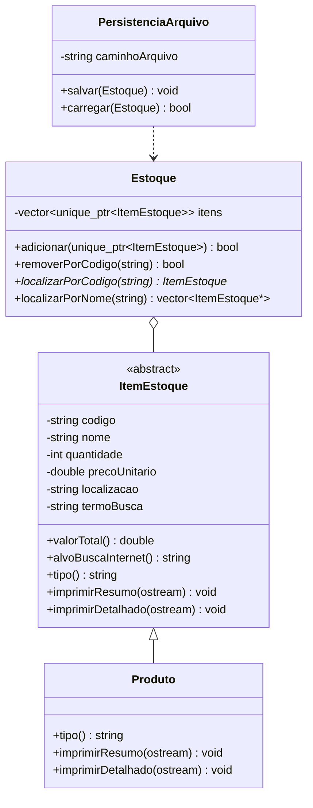

# Modulo de Estoque - Trabalho Final POO

Projeto em C++ para a etapa 1 do trabalho final: aplicacao de console com
cadastro de itens de estoque e persistencia em arquivo.

## Funcionalidades

- Adicionar item.
- Apagar item.
- Mostrar item por codigo.
- Localizar item por codigo ou parte do nome.
- Modificar item.
- Salvar itens em arquivo texto (`data/estoque.txt`).
- Carregar automaticamente os itens do arquivo ao iniciar.
- Imprimir listagem de itens no console.
- Abrir o navegador para buscar o item na internet.

## Conceitos de POO usados

- Classe base: `ItemEstoque`.
- Heranca: `Produto` herda de `ItemEstoque`.
- Polimorfismo: o estoque guarda `std::unique_ptr<ItemEstoque>` e chama metodos
  virtuais como `imprimirResumo` e `imprimirDetalhado`.
- Encapsulamento: atributos privados com metodos de acesso e alteracao.

## Diagrama de classes



## Como compilar e executar

### Com CMake

```bash
cmake -S . -B build-mingw -G "MinGW Makefiles"
cmake --build build-mingw
.\build-mingw\estoque.exe
```

### Com g++ diretamente

```bash
g++ -std=c++17 -Wall -Wextra -Iinclude src/*.cpp -o estoque.exe
.\estoque.exe
```

## Arquivo de dados

O programa cria o arquivo `data/estoque.txt` automaticamente ao salvar. Cada
linha guarda um item em formato separado por `|`:

```text
codigo|nome|quantidade|preco|localizacao|busca
```

Exemplo:

```text
D001|Mouse sem fio|10|89.900000|Prateleira A1|mouse sem fio
```
