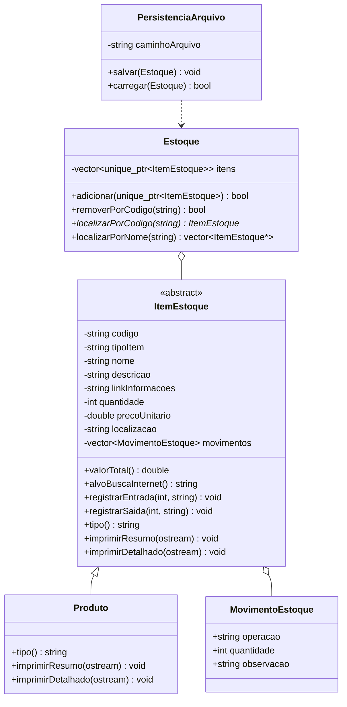

# Modulo de Estoque - Trabalho Final POO

Projeto em C++ para a etapa 1 do trabalho final: aplicacao de console com
controle de inventario, entradas e saidas de produtos ou materiais.

## Funcionalidades

- Adicionar item.
- Apagar item.
- Mostrar item por codigo.
- Localizar item por codigo ou parte do nome.
- Modificar dados cadastrais do item.
- Registrar entrada de item.
- Registrar saida de item.
- Salvar itens em arquivo texto (`data/estoque.txt`).
- Carregar automaticamente os itens do arquivo ao iniciar.
- Imprimir listagem de itens no console.
- Abrir o navegador usando o link de informacoes do item.

## Informacoes armazenadas

- Id/codigo do item.
- Tipo: produto ou material.
- Nome do item.
- Descricao do item.
- Link para informacoes do item com imagem.
- Quantidade atual do item.
- Registro de entradas e saidas.
- Preco unitario e localizacao no estoque, como campos auxiliares.

## Conceitos de POO usados

- Classe base: `ItemEstoque`.
- Heranca: `Produto` herda de `ItemEstoque`.
- Polimorfismo: o estoque guarda `std::unique_ptr<ItemEstoque>` e chama metodos
  virtuais como `tipo`, `imprimirResumo` e `imprimirDetalhado`.
- Encapsulamento: atributos privados com metodos de acesso e alteracao.

## Diagrama de classes



## Como compilar e executar

### Com CMake

```bash
cmake -S . -B build-mingw -G "MinGW Makefiles"
cmake --build build-mingw
.\build-mingw\estoque.exe
```

### Com g++ diretamente

```bash
g++ -std=c++17 -Wall -Wextra -Iinclude src/*.cpp -o estoque.exe
.\estoque.exe
```

## Arquivo de dados

O programa cria o arquivo `data/estoque.txt` automaticamente ao salvar.
O formato usa uma linha para o item e uma linha para cada movimento:

```text
ITEM|codigo|tipo|nome|descricao|linkInformacoes|quantidade|preco|localizacao
MOV|codigo|operacao|quantidade|observacao
```

Exemplo:

```text
ITEM|D001|produto|Mouse sem fio|Mouse sem fio para computadores.|https://www.google.com/search?tbm=isch&q=mouse+sem+fio|10|89.900000|Prateleira A1
MOV|D001|Entrada|10|Cadastro inicial.
```
