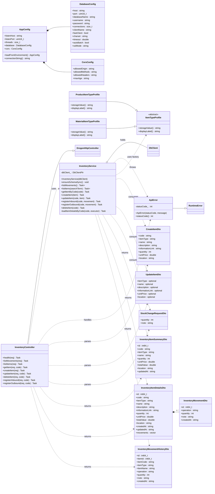

# Backend Class Diagram

```mermaid
classDiagram
    direction LR

    class DrogonHttpController
    class DbClient
    class RuntimeError

    class InventoryController {
        +health(req) Task<HttpResponsePtr>
        +listMovements(req) Task<HttpResponsePtr>
        +listItems(req) Task<HttpResponsePtr>
        +getItem(req, code) Task<HttpResponsePtr>
        +createItem(req) Task<HttpResponsePtr>
        +updateItem(req, code) Task<HttpResponsePtr>
        +deleteItem(req, code) Task<HttpResponsePtr>
        +registerInbound(req, code) Task<HttpResponsePtr>
        +registerOutbound(req, code) Task<HttpResponsePtr>
    }

    class InventoryService {
        -dbClient_ : DbClientPtr
        +InventoryService(dbClient)
        +ensureSchemaSync() void
        +listMovements() Task<vector<InventoryMovementHistoryDto>>
        +listItems(searchTerm) Task<vector<InventoryItemSummaryDto>>
        +getItemByCode(code) Task<InventoryItemDetailsDto>
        +createItem(item) Task<InventoryItemDetailsDto>
        +updateItem(code, item) Task<InventoryItemDetailsDto>
        +registerInbound(code, movement) Task<InventoryItemDetailsDto>
        +registerOutbound(code, movement) Task<InventoryItemDetailsDto>
        +deleteItem(code) Task<void>
        -loadItemDetailsByCode(code, executor) Task<InventoryItemDetailsDto>
    }

    class ItemTypeProfile {
        <<abstract>>
        +storageValue() string
        +displayLabel() string
    }

    class ProductItemTypeProfile {
        +storageValue() string
        +displayLabel() string
    }

    class MaterialItemTypeProfile {
        +storageValue() string
        +displayLabel() string
    }

    class ApiError {
        -statusCode_ : int
        +ApiError(statusCode, message)
        +statusCode() int
    }

    class AppConfig {
        +listenHost : string
        +listenPort : uint16_t
        +threads : size_t
        +database : DatabaseConfig
        +cors : CorsConfig
        +loadFromEnvironment() AppConfig
        +connectionString() string
    }

    class DatabaseConfig {
        +host : string
        +port : uint16_t
        +databaseName : string
        +username : string
        +password : string
        +connections : size_t
        +clientName : string
        +fastClient : bool
        +charset : string
        +timeout : double
        +autoBatch : bool
        +sslMode : string
    }

    class CorsConfig {
        +allowedOrigin : string
        +allowedMethods : string
        +allowedHeaders : string
        +maxAge : string
    }

    class InventoryMovementDto {
        +id : int64_t
        +operation : string
        +quantity : int
        +note : string
        +createdAt : string
    }

    class InventoryMovementHistoryDto {
        +id : int64_t
        +itemId : int64_t
        +itemCode : string
        +itemType : string
        +itemName : string
        +operation : string
        +quantity : int
        +note : string
        +createdAt : string
    }

    class InventoryItemSummaryDto {
        +id : int64_t
        +code : string
        +itemType : string
        +name : string
        +quantity : int
        +unitPrice : double
        +totalValue : double
        +location : string
        +updatedAt : string
    }

    class InventoryItemDetailsDto {
        +id : int64_t
        +code : string
        +itemType : string
        +name : string
        +description : string
        +informationLink : string
        +quantity : int
        +unitPrice : double
        +totalValue : double
        +location : string
        +createdAt : string
        +updatedAt : string
        +movements : vector<InventoryMovementDto>
    }

    class CreateItemDto {
        +code : string
        +itemType : string
        +name : string
        +description : string
        +informationLink : string
        +quantity : int
        +unitPrice : double
        +location : string
    }

    class UpdateItemDto {
        +itemType : optional<string>
        +name : optional<string>
        +description : optional<string>
        +informationLink : optional<string>
        +unitPrice : optional<double>
        +location : optional<string>
    }

    class StockChangeRequestDto {
        +quantity : int
        +note : string
    }

    InventoryController --|> DrogonHttpController
    ApiError --|> RuntimeError
    ProductItemTypeProfile --|> ItemTypeProfile
    MaterialItemTypeProfile --|> ItemTypeProfile

    AppConfig *-- DatabaseConfig
    AppConfig *-- CorsConfig
    InventoryItemDetailsDto *-- "0..*" InventoryMovementDto

    InventoryController ..> InventoryService : uses
    InventoryController ..> ApiError : handles
    InventoryController ..> CreateItemDto : parses
    InventoryController ..> UpdateItemDto : parses
    InventoryController ..> StockChangeRequestDto : parses
    InventoryController ..> InventoryItemSummaryDto : returns
    InventoryController ..> InventoryItemDetailsDto : returns
    InventoryController ..> InventoryMovementHistoryDto : returns

    InventoryService o-- DbClient : holds
    InventoryService ..> ApiError : throws
    InventoryService ..> ItemTypeProfile : uses factory
    InventoryService ..> CreateItemDto : consumes
    InventoryService ..> UpdateItemDto : consumes
    InventoryService ..> StockChangeRequestDto : consumes
    InventoryService ..> InventoryItemSummaryDto : returns
    InventoryService ..> InventoryItemDetailsDto : returns
    InventoryService ..> InventoryMovementHistoryDto : returns
```
